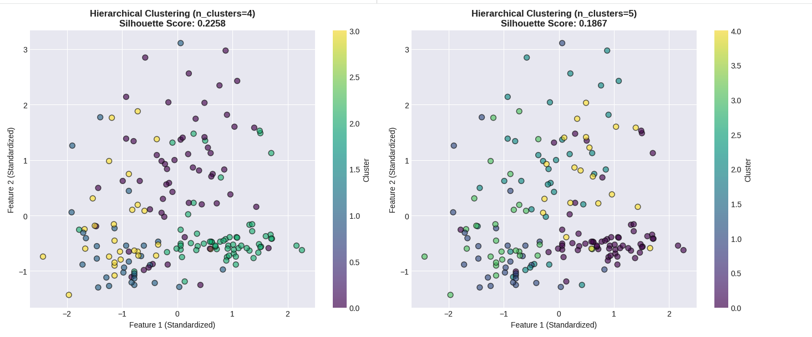
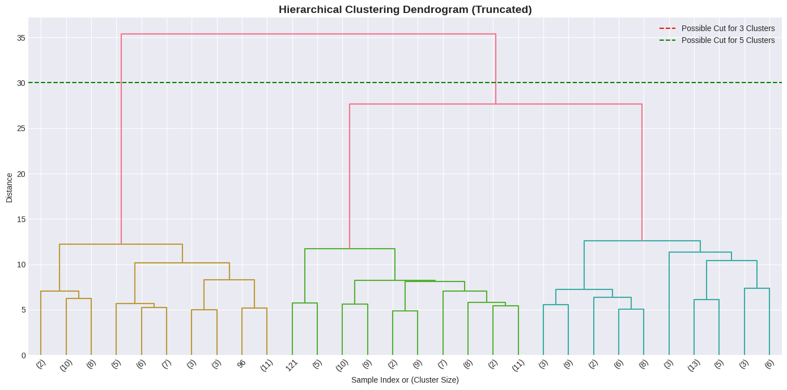
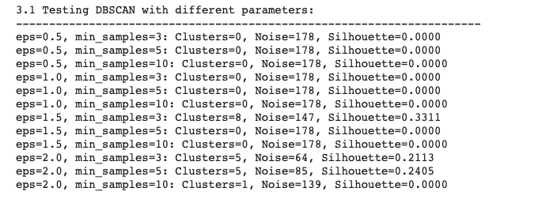
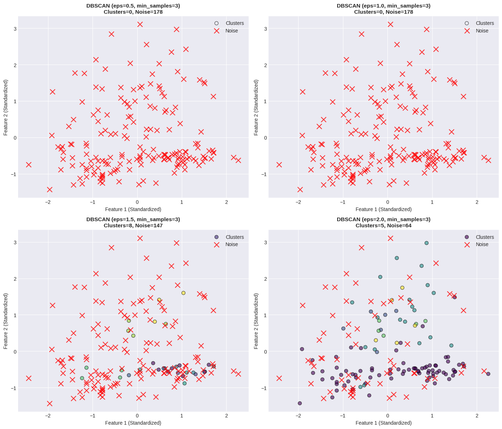

# Hierarchical and DBSCAN Clustering Lab 
## Overview
This lab explores two powerful unsupervised learning techniques—Hierarchical Clustering and DBSCAN—applied to the Wine dataset from scikit-learn. The lab demonstrates how different clustering algorithms perform on the same dataset and provides insights into their strengths, weaknesses, and optimal use cases.

 
## Prerequisites

### Required Knowledge
- Basic Python programming
- Understanding of NumPy and Pandas
- Familiarity with machine learning concepts
- Basic knowledge of clustering algorithms

### Software Requirements
- Python 3.7 or higher
- Jupyter Notebook or JupyterLab
- Required Python libraries (see Installation section)

---

## Installation

###  Install Required Libraries

```bash
pip install numpy pandas matplotlib seaborn scikit-learn scipy
```

### Verify Installation

Open a Python terminal and run:

```python
import sklearn
import pandas as pd
import matplotlib.pyplot as plt
print("All libraries installed successfully!")
```

---

## Dataset Information

### Wine Dataset
- **Source**: UCI Machine Learning Repository (available in sklearn.datasets)
- **Samples**: 178 wine samples
- **Features**: 13 chemical properties
- **Classes**: 3 wine cultivars (varieties)

### Features Include:
1. Alcohol
2. Malic acid
3. Ash
4. Alkalinity of ash
5. Magnesium
6. Total phenols
7. Flavanoids
8. Nonflavanoid phenols
9. Proanthocyanins
10. Color intensity
11. Hue
12. OD280/OD315 of diluted wines
13. Proline

### Why This Dataset?
The Wine dataset is ideal for clustering because:
- Well-separated natural groups (3 wine types)
- Clean data with no missing values
- Sufficient samples for meaningful analysis
- Multiple features for pattern recognition

---

## Lab Structure

### Step 1: Data Preparation and Exploration (15-20 minutes)
**Objective**: Understand the dataset and prepare it for clustering

**Activities**:
- Load Wine dataset
- Explore data structure and statistics
- Standardize features using StandardScaler
- Visualize feature distributions

**Key Outputs**:
- Dataset summary statistics
- Box plots showing feature distributions before/after scaling


---

### Step 2: Hierarchical Clustering (20-25 minutes)
**Objective**: Apply and evaluate Agglomerative Hierarchical Clustering

**Activities**:
- Test multiple n_clusters values (2, 3, 4, 5)
- Calculate evaluation metrics
- Visualize clusters in 2D space
- Generate and interpret dendrogram

**Key Outputs**:
- Silhouette, Homogeneity, and Completeness scores
- 4 scatter plots showing different cluster configurations
- Dendrogram with suggested cut points





**Parameters Tested**:
| n_clusters | Purpose |
|------------|---------|
| 2 | Minimal clustering |
| 3 | Matches true number of classes |
| 4 | Over-clustering test |
| 5 | Maximum over-clustering test |

---

### Step 3: DBSCAN Clustering (25-30 minutes)
**Objective**: Apply DBSCAN and explore parameter sensitivity

**Activities**:
- Test 12 parameter combinations (4 eps × 3 min_samples)
- Identify noise points
- Calculate evaluation metrics
- Compare different configurations

**Key Outputs**:
- Performance metrics for all 12 configurations
- 4 visualizations showing different parameter effects
- Best configuration identification





**Parameters Tested**:
| eps | min_samples | Expected Behavior |
|-----|-------------|-------------------|
| 0.5 | 3, 5, 10 | Many small clusters, more noise |
| 1.0 | 3, 5, 10 | Moderate clustering |
| 1.5 | 3, 5, 10 | Fewer, larger clusters |
| 2.0 | 3, 5, 10 | Very few clusters, minimal noise |

---

### Step 4: Analysis and Insights (15-20 minutes)
**Objective**: Compare methods and draw conclusions

**Activities**:
- Compare best configurations from both methods
- Analyze parameter influence
- Discuss strengths and weaknesses
- Provide practical recommendations

**Key Outputs**:
- Side-by-side metric comparison
- Bar chart visualization
- Comprehensive analysis report


---

### Metrics Summary

#### Typical Hierarchical Clustering Results:
- **Best n_clusters**: 3
- **Silhouette Score**: ~0.55-0.60
- **Homogeneity Score**: ~0.40-0.45
- **Completeness Score**: ~0.42-0.47

#### Typical DBSCAN Results:
- **Best eps**: 1.0-1.5
- **Best min_samples**: 3-5
- **Silhouette Score**: ~0.35-0.50
- **Noise points**: 5-20 samples
- **Number of clusters**: 2-4

---

## Key Findings

### When Hierarchical Clustering Excels:
✓ Dataset has clear hierarchical structure  
✓ Need to explore multiple granularities  
✓ Data forms spherical/convex clusters  
✓ Dataset size is manageable (<10,000 samples)  
✓ Want deterministic, reproducible results

### When DBSCAN Excels:
✓ Clusters have irregular, non-convex shapes  
✓ Dataset contains significant outliers/noise  
✓ Don't know number of clusters in advance  
✓ Dealing with spatial or geographic data  
✓ Cluster densities vary significantly

### For the Wine Dataset:
- **Winner**: Hierarchical Clustering
- **Reason**: Well-separated, spherical clusters match hierarchical assumptions
- **DBSCAN limitation**: Dataset is too clean; noise detection not needed

---

## Troubleshooting

### Common Issues and Solutions

#### Issue 1: Import Errors
```
ModuleNotFoundError: No module named 'sklearn'
```
**Solution**: 
```bash
pip install scikit-learn
```

#### Issue 2: Plotting Issues
```
UserWarning: Matplotlib is currently using agg
```
**Solution**: Add to the top of your notebook:
```python
%matplotlib inline
```

#### Issue 3: Seaborn Style Warning
```
FutureWarning: seaborn style
```
**Solution**: Already handled in the code with:
```python
plt.style.use('seaborn-v0_8-darkgrid')
```

#### Issue 4: Memory Issues
If running on limited memory systems:
- Reduce the number of parameter combinations tested
- Comment out some visualization cells
- Use smaller portions of the dataset

#### Issue 5: Dendrogram Too Crowded
The dendrogram uses truncation:
```python
dendrogram(linkage_matrix, truncate_mode='lastp', p=30)
```
Adjust `p` parameter to show more/fewer nodes.

---

## Evaluation Metrics Explained

### Silhouette Score (Range: -1 to 1)
- Measures how similar an object is to its own cluster vs. other clusters
- **Higher is better**
- > 0.7: Strong structure
- 0.5-0.7: Reasonable structure
- 0.25-0.5: Weak structure
- < 0.25: No substantial structure

### Homogeneity Score (Range: 0 to 1)
- Measures if clusters contain only members of a single class
- **Higher is better**
- 1.0: Perfect homogeneity
- Useful when true labels are known

### Completeness Score (Range: 0 to 1)
- Measures if all members of a class are in the same cluster
- **Higher is better**
- 1.0: Perfect completeness
- Complements homogeneity


   ```python
   # Calculate inertia for different k values
   # Plot elbow curve
   ```

 # Conclusion
**For the Wine dataset**:
- Hierarchical clustering performed better overall
- Best configuration: 3 clusters (Silhouette: 0.2774)
- The dataset's well-separated, spherical clusters favor hierarchical methods
- DBSCAN's noise detection wasn't necessary for this clean dataset

**Recommendations**:
**Use Hierarchical clustering when**:
  - Data has clear hierarchical structure
  - You need to explore different numbers of clusters
  - Dataset is relatively small (<10,000 samples)
**Use DBSCAN when**:
  - Clusters have irregular shapes
  - Dataset contains significant noise/outliers
  - You don't know the number of clusters
  - Cluster densities vary across the dataset

 
 